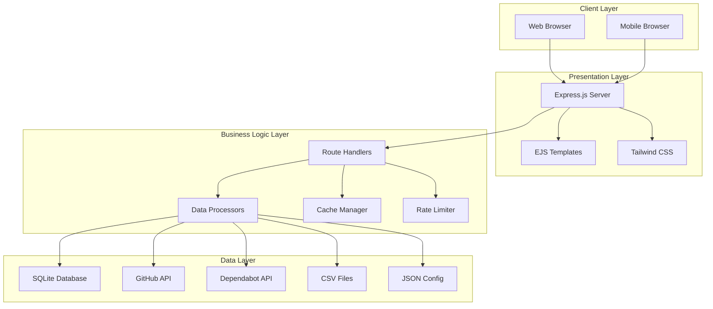
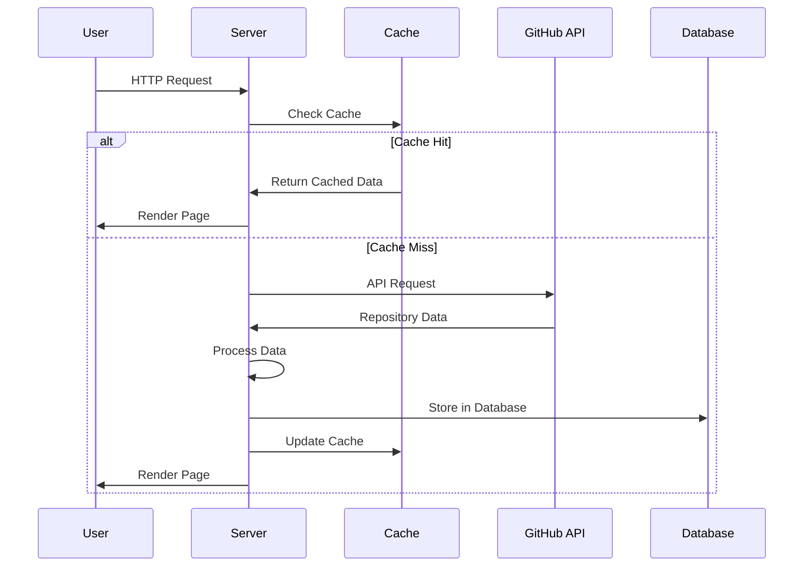

# 🏗️ Sovellusportfolio - Arkkitehtuurikuvaus

## 📋 Sisällysluettelo

1. [Yleiskuvaus](#yleiskuvaus)
2. [Arkkitehtuurin komponentit](#arkkitehtuurin-komponentit)
3. [Tietovirta ja datan käsittely](#tietovirta-ja-datan-käsittely)
4. [Tietokantarakenne](#tietokantarakenne)
5. [API-rajapinnat](#api-rajapinnat)
6. [Frontend-arkkitehtuuri](#frontend-arkkitehtuuri)
7. [Turvallisuus](#turvallisuus)
8. [Suorituskyky ja skaalautuvuus](#suorituskyky-ja-skaalautuvuus)
9. [Kehitysympäristö](#kehitysympäristö)
10. [Monitoring ja Logging](#monitoring-ja-logging)
11. [Tulevaisuuden suunnitelmat](#tulevaisuuden-suunnitelmat)

---

## 🎯 Yleiskuvaus

**Sovellusportfolio** on Node.js-pohjainen web-sovellus, joka analysoi Helsingin kaupungin GitHub-organisaation repositoryjä ja tarjoaa visuaalisen yhteenvedon teknologioista, framework-versioista ja turvallisuustilanteesta.

### 🎯 Pääasialliset tavoitteet

- **Tilannekuva**: Tarjoa selkeä näkymä Helsingin kaupungin teknologisesta portfoliosta
- **Turvallisuus**: Seuraa ja raportoi turvallisuusriskejä Dependabot-tietojen avulla
- **Ylläpito**: Auta tunnistamaan vanhentuneet teknologiat ja framework-versiot
- **Suorituskyky**: Tarjoa nopea käyttökokemus caching-strategian avulla

---

## 🧩 Arkkitehtuurin komponentit

### 📊 Yleisarkkitehtuuri



### 🔧 Komponenttien yksityiskohdat

#### **1. Express.js Server (`server.js`)**
- **Rooli**: Sovelluksen pääpalvelin ja API-gateway
- **Vastuut**:
  - HTTP-pyyntöjen käsittely
  - Reittien hallinta
  - Middleware-konfiguraatio
  - Staattisten tiedostojen tarjoilu

#### **2. Kerrosarkkitehtuuri**

Sovellus käyttää **kerrosarkkitehtuuria** (layered architecture):

- **Routes** (`src/app/routes/`): HTTP-reitit
  - `repositories.js` - Repository-reitit
  - `commits.js` - Commits-reitit
  - `teams.js` - Teams-reitit
  - `collaborators.js` - Collaborators-reitit
  - `issues.js` - Issues-reitit
  - `pullRequests.js` - Pull Requests-reitit

- **Controllers** (`src/app/controllers/`): HTTP-pyyntöjen käsittely
  - `repositoryController.js` - Repository-kontrolleri
  - `commitsController.js` - Commits-kontrolleri
  - `teamsController.js` - Teams-kontrolleri
  - `collaboratorsController.js` - Collaborators-kontrolleri
  - `issuesController.js` - Issues-kontrolleri
  - `pullRequestsController.js` - Pull Requests-kontrolleri

- **Services** (`src/domain/services/`): Liiketoimintalogiikka
  - `repositoryService.js` - Repository-palvelu
  - `commitsService.js` - Commits-palvelu
  - `teamsService.js` - Teams-palvelu
  - `collaboratorsService.js` - Collaborators-palvelu
  - `issuesService.js` - Issues-palvelu
  - `pullRequestsService.js` - Pull Requests-palvelu

- **Repositories** (`src/data/repositories/`): Tietokanta-operaatiot
  - `repositoryRepository.js` - Repository-operaatiot
  - `cacheRepository.js` - Cache-operaatiot

#### **3. Route Handlers**
- **Pääsivu** (`/`): Kielijakauma ja repository-yhteenveto
- **Repositories** (`/repositories`): Suodatettava ja järjestettävä repository-lista
- **Commits** (`/commits`): Viimeisimmät commitit ja tilastot
- **Teams** (`/teams`): Organisaation tiimit ja jäsenet
- **Collaborators** (`/collaborators`): Repository-kohtaiset collaboratorit
- **Issues** (`/issues`): Issue-tilastot ja lista
- **Pull Requests** (`/pull_requests`): PR-tilastot ja lista
- **Dockerfile** (`/dockerfile`): Docker-kontainerien analyysi
- **Django** (`/django`): Python/Django-sovellukset
- **React** (`/react`): JavaScript/React-sovellukset
- **Drupal** (`/drupal`): PHP/Drupal-sivustot
- **Dependabot** (`/dependabot`): Turvallisuusilmoitukset
- **HDS** (`/hds`): Helsinki Design System -komponentit
- **Settings** (`/settings`): Sovellusasetukset

#### **3. Data Processors**
- **Repository Analyzer**: Analysoi GitHub-repositoryjä
- **Framework Detector**: Tunnistaa käytetyt framework-versiot
- **Security Scanner**: Skannaa turvallisuusriskejä
- **Language Classifier**: Luokittelee ohjelmointikielet
- **EOL Checker**: Tarkistaa End-of-Life -tilanteen Django ja Docker -versioille
- **HDS Detector**: Tunnistaa Helsinki Design System -komponenttien käytön

#### **4. Cache Manager (`UnifiedCacheManager`)**
- **Tarkoitus**: Parantaa suorituskykyä ja vähentää API-kutsuja
- **Strategia**: Unified cache (Redis + SQLite/Memory fallback)
  - **Redis** (vapaaehtoinen): Nopea, skaalautuva cache
  - **SQLite/Memory fallback**: Graceful degradation jos Redis ei ole käytettävissä
- **Expiration**: Automaattinen vanhentuminen (TTL)
- **Deduplication**: Estää duplikaattikutsut Map-tietorakenteella
- **Persistence**: Cache-persistenssi Redis:ssä ja/tai SQLite:ssä
- **Automatic Cleanup**: Säännöllinen vanhentuneen datan siivoaminen
- **Statistics**: Cache-hit/miss -tilastot ja monitoring

#### **5. Rate Limiter (`RateLimiter`)**
- **Tarkoitus**: Noudattaa GitHub API:n rate limitejä
- **Strategia**: Queue-based throttling vaiheittaisella viiveellä
- **Monitoring**: Reaaliaikainen seuranta
- **Fallback**: Graceful degradation kun rate limiting on pois päältä
- **Configurable**: Kytkettävissä ympäristömuuttujilla (`RATE_LIMIT_ENABLED`)
- **Adaptive**: Dynaaminen batch-koko riippuen rate limit -tilanteesta

---

## 🔄 Tietovirta ja datan käsittely

### 📊 Datan käsittelypipeline



### 🔍 Datan analyysiprosessi

#### **1. Repository Collection**
```javascript
// GitHub API:sta haetaan organisaation repositoryt
const repositories = await getRecentRepositories();
```

#### **2. Framework Detection**
```javascript
// Jokaiselle repositorylle analysoidaan teknologiat (batch-käsittely)
for (const repo of repositories) {
  repo.dockerData = await getDockerDataForRepo(repo);
  repo.djangoData = await getDjangoDataForRepo(repo);
  repo.reactData = await getReactDataForRepo(repo);
  repo.drupalData = await getDrupalDataForRepo(repo);
  repo.dependabotData = await getDependabotDataForRepo(repo);
  repo.hdsData = await getHDSDataForRepo(repo);
  
  // EOL-tarkistukset
  if (repo.djangoData) {
    repo.djangoEOL = checkDjangoEOL(repo.django_version);
  }
  if (repo.dockerData) {
    repo.dockerEOL = checkDockerEOL(repo.docker_base_image);
  }
}
```

#### **3. Data Aggregation**
```javascript
// Yhdistetään ja analysoidaan data
const languageStats = aggregateLanguageStats(repositories);
const frameworkStats = aggregateFrameworkStats(repositories);
const securityStats = aggregateSecurityStats(repositories);
```

---

## 🗄️ Tietokantarakenne

### 📊 SQLite-tietokanta (`portfolio.db`)

#### **1. Cache Table**
```sql
CREATE TABLE cache (
  id INTEGER PRIMARY KEY AUTOINCREMENT,
  key TEXT UNIQUE NOT NULL,
  data TEXT NOT NULL,
  created_at DATETIME DEFAULT CURRENT_TIMESTAMP,
  expires_at DATETIME NOT NULL
);
```

#### **2. Repositories Table**
```sql
CREATE TABLE repositories (
  id INTEGER PRIMARY KEY AUTOINCREMENT,
  name TEXT NOT NULL UNIQUE,
  full_name TEXT NOT NULL,
  description TEXT,
  html_url TEXT,
  clone_url TEXT,
  homepage TEXT,
  language TEXT,
  languages TEXT,
  stargazers_count INTEGER,
  forks_count INTEGER,
  updated_at DATETIME,
  created_at DATETIME,
  topics TEXT,
  readme TEXT,
  docker_base_image TEXT,
  django_version TEXT,
  react_version TEXT,
  drupal_version TEXT,
  dependabot_critical_count INTEGER,
  last_updated DATETIME DEFAULT CURRENT_TIMESTAMP
);
```

#### **3. Indeksit**
```sql
-- Cache-indeksit
CREATE INDEX idx_cache_key ON cache(key);
CREATE INDEX idx_cache_expires ON cache(expires_at);

-- Repository-indeksit
CREATE INDEX idx_repos_name ON repositories(name);
CREATE INDEX idx_repos_updated ON repositories(updated_at);
CREATE INDEX idx_repos_language ON repositories(language);
CREATE INDEX idx_repos_full_name ON repositories(full_name);

-- Composite indeksit (suorituskykyoptimoinnit)
CREATE INDEX idx_repos_language_updated ON repositories(language, updated_at DESC);
CREATE INDEX idx_repos_stars_updated ON repositories(stargazers_count DESC, updated_at DESC);
```

#### **4. Migraatiojärjestelmä**
- **MigrationManager** (`src/data/migrations/migrationManager.js`): Hallitsee tietokantamigraatioita
- **001_initial_schema.js**: Alkuperäinen skeema (cache ja repositories -taulut)
- **002_add_composite_indexes.js**: Composite-indeksit suorituskykyoptimoinnille

#### **5. Tietokantayhteys**
- **DatabaseConnection** (`src/data/database/dbConnection.js`): Robusti tietokantayhteys
  - **Retry-logiikka**: Automaattiset uudelleenyritykset
  - **WAL-tila**: Write-Ahead Logging parantamaan suorituskykyä
  - **Busy timeout**: Käsittelee kiireisiä tilanteita

### 📁 Tiedostopohjainen data

#### **1. EOL Data (`django-eol.json`, `docker-eol.json`)**
- **django-eol.json**: Django-versioiden End-of-Life tiedot
  - Tuettujen versioiden lista
  - EOL-päivämäärät
  - Päivityssuositukset
- **docker-eol.json**: Docker base image -tietojen EOL-tilanteet
  - Tuettujen image-versioiden lista
  - EOL-päivämäärät
  - Turvallisuusvaroitukset

---

## 🌐 API-rajapinnat

### 🔗 GitHub API Integration

#### **1. Repository API**
```javascript
// Hakee organisaation repositoryt
GET /orgs/{org}/repos
```

#### **2. Content API**
```javascript
// Hakee repositoryn sisältöä
GET /repos/{owner}/{repo}/contents/{path}

// Etsitään vain production Dockerfilee
const dockerfilePaths = [
  'Dockerfile',
  'Dockerfile.prod',
  'docker/Dockerfile',
  'docker/Dockerfile.prod',
  'build/Dockerfile',
  'deploy/Dockerfile',
  '.docker/Dockerfile'
];
```

#### **2.1 Search API**
```javascript
// GitHub Search API:lla haetaan Dockerfile-tiedostoja
GET /search/code?q=filename:Dockerfile+repo:{owner}/{repo}
```

#### **3. Dependabot API**
```javascript
// Hakee turvallisuusilmoitukset
GET /repos/{owner}/{repo}/dependabot/alerts
```

### 🏠 Internal API Routes

#### **1. Main Routes (Sivut)**
- `GET /` - Päänäkymä (kielijakauma ja repository-yhteenveto)
- `GET /repositories` - Repositoryt-sivu (suodatuksella ja paginoinnilla)
- `GET /commits` - Commits-sivu (viimeisimmät commitit ja tilastot)
- `GET /teams` - Teams-sivu (organisaation tiimit ja jäsenet)
- `GET /collaborators` - Collaborators-sivu (repository-kohtaiset collaboratorit)
- `GET /issues` - Issues-sivu (issue-tilastot ja lista)
- `GET /pull_requests` - Pull Requests-sivu (PR-tilastot ja lista)
- `GET /dockerfile` - Docker-analyysi (EOL-tarkistus mukana)
- `GET /django` - Django-sovellukset (EOL-tarkistus mukana)
- `GET /react` - React-sovellukset
- `GET /drupal` - Drupal-sivustot
- `GET /dependabot` - Turvallisuusilmoitukset
- `GET /hds` - HDS-komponentit
- `GET /settings` - Asetukset

#### **2. API Endpoints**
- `GET /api/repos` - JSON API repositorytietojen hakuun
  - Query params: `language`, `minStars`, `orderBy`, `orderDirection`, `limit`, `offset`, `refresh`
- `GET /api/rate-limit` - Rate limit -tilan tarkistus
- `GET /api/cache` - Cache-tilastot ja tiedot
- `POST /api/cache/clear` - Cache-tyhjennys
- `POST /api/cache/invalidate/:repoName` - Invalidoi tietyn repon cache
- `POST /api/cache/cleanup` - Puhdista vanhentuneet cache-merkinnät
- `GET /api/db/repos` - Database-repojen haku
- `GET /api/db/stats` - Database-tilastot

Katso [API-dokumentaatio](docs/API.md) yksityiskohtaisemmasta API-kuvauksesta.

#### **3. Query Parameters**
- `?refresh=true` - Pakottaa API-päivityksen
- `?debug=true` - Debug-tiedot

---

## 🎨 Frontend-arkkitehtuuri

### 📱 Responsiivinen design

#### **1. Layout Structure**
```html
<div class="flex min-h-screen">
  <aside class="w-64"> <!-- Navigation -->
  <main class="flex-1"> <!-- Content -->
</div>
```

#### **2. Navigation Components**
- **Logo**: Helsingin kaupungin logo (base64-encoded SVG)
- **Menu Items**: 
  - Etusivu (Dashboard)
  - Dockerfile (Docker-analyysi)
  - Django (Python/Django)
  - React (JavaScript/React)
  - Drupal (PHP/Drupal)
  - Dependabot (Turvallisuus)
  - HDS (Helsinki Design System)
- **Settings**: Sovellusasetukset

#### **3. Content Areas**
- **Statistics Cards**: Kieltien, frameworkien ja turvallisuustilastot
- **Data Tables**: Repository-luettelot sortattavina
- **Charts**: Piirakkagraafit kielijakaumasta (SVG)
- **Status Indicators**: EOL-tilanteet ja turvallisuustilanteet
- **Version Distribution**: Framework-versioiden jakaumat
- **Package Lists**: HDS- ja dependency-pakettien luettelot

### 🎨 Styling Architecture

#### **1. CSS Framework**
- **Tailwind CSS**: Utility-first CSS framework
- **Custom CSS**: `public/css/style.css`
- **Material Symbols**: Google's icon library
- **Font Awesome**: Additional icons

#### **2. Color System**
```javascript
const languageColors = {
  'JavaScript': '#f1e05a',
  'TypeScript': '#2b7489',
  'Python': '#3572A5',
  'Java': '#b07219',
  'PHP': '#4F5D95',
  // ... more languages
};
```

#### **3. Dark Mode Support**
- CSS custom properties
- Automatic theme detection
- User preference storage

---

## 🔒 Turvallisuus

### 🛡️ API Security

#### **1. Authentication**
```javascript
const githubHeaders = {
  'Authorization': `token ${GITHUB_TOKEN}`,
  'Accept': 'application/vnd.github.v3+json',
  'User-Agent': 'Application-Portfolio'
};
```

#### **2. Rate Limiting**
- **GitHub API**: 5000 requests/hour
- **Dependabot API**: 5000 requests/hour
- **Queue Management**: Automatic throttling with queue
- **Fallback Strategy**: Graceful degradation
- **Configurable**: Rate limiting voi olla pois päältä (`RATE_LIMIT_ENABLED=false`)
- **Debug Mode**: Rate limit -tilan seuranta (`RATE_LIMIT_DEBUG=true`)
- **Concurrent Requests**: Max 30 samanaikaista API-kutsua
- **Adaptive Batching**: Dynaaminen batch-koko riippuen rate limitista

#### **3. Input Validation**
- Repository name sanitization
- URL validation
- SQL injection prevention
- XSS protection

### 🔐 Data Protection

#### **1. Sensitive Data**
- GitHub tokens in environment variables
- No hardcoded credentials
- Secure token storage

#### **2. Error Handling**
- Graceful error messages
- No sensitive data in logs
- Proper HTTP status codes
- Retry logic for transient failures
- Request deduplication

#### **3. EOL-tarkistukset**
- **Django EOL**: Tarkistaa Django-versioiden tuen päättymispäivät
- **Docker EOL**: Tarkistaa Docker base image -tietojen tuen päättymispäivät
- **Real-time**: Suoritetaan data-haun yhteydessä
- **Visual Indicators**: Korostetaan EOL-versiot käyttöliittymässä

---

## ⚡ Suorituskyky ja skaalautuvuus

### 🚀 Performance Optimizations

#### **1. Caching Strategy**
```javascript
// Database-first caching with TTL
if (refreshData) {
  repositories = await getRecentRepositories(); // Force refresh from API
} else {
  repositories = await cacheManager.getRepositories(); // Load from DB
  if (repositories.length === 0) {
    repositories = await getRecentRepositories(); // Fallback to API
  }
}
```

#### **1.1 Batch Processing**
```javascript
// Batch-käsittely suorituskyvyn optimoimiseksi
const batchSize = getOptimalBatchSize(); // Dynaaminen batch-koko
for (let i = 0; i < repos.length; i += batchSize) {
  const batch = repos.slice(i, i + batchSize);
  await Promise.allSettled(batch.map(repo => process(repo)));
  // Tauko batchien välissä rate limitin vuoksi
  if (i + batchSize < repos.length) {
    await delay(1000-5000); // Dynaminen viive
  }
}
```

#### **2. Database Optimizations**
- **Indexes**: Optimized queries
- **Connection Pooling**: Efficient database access
- **Query Optimization**: Minimal data transfer

#### **3. Frontend Optimizations**
- **Static Assets**: CDN-ready
- **Image Optimization**: SVG logos
- **CSS Minification**: Tailwind CSS
- **JavaScript Bundling**: Minimal dependencies

### 📈 Scalability Considerations

#### **1. Horizontal Scaling**
- Stateless application design
- Database separation
- Load balancer ready

#### **2. Vertical Scaling**
- Memory-efficient data structures
- Efficient algorithms
- Resource monitoring

#### **3. Current Enhancements**
- ✅ **Redis caching layer**: UnifiedCacheManager tukee Redisia
- ✅ **Database migrations**: Migraatiojärjestelmä käytössä
- ✅ **Composite indexes**: Suorituskykyoptimoinnit
- ✅ **Connection pooling**: Robusti tietokantayhteys
- ✅ **Testing**: Jest-yksikkö- ja integraatiotestit

#### **4. Future Enhancements**
- Microservices architecture
- Container deployment (Docker)
- CI/CD Pipeline

---

## 🛠️ Kehitysympäristö

### 📦 Development Setup

#### **1. Dependencies**
```json
{
  "dependencies": {
    "express": "^4.18.2",
    "axios": "^1.6.0",
    "sqlite3": "^5.1.6",
    "csv-parser": "^3.0.0",
    "dotenv": "^16.3.1",
    "ejs": "^3.1.9"
  }
}
```

#### **2. Environment Configuration**
```bash
GITHUB_TOKEN=your_github_personal_access_token_here
GITHUB_ORG=City-of-Helsinki
PORT=3000
NODE_ENV=development

# Rate limiting konfiguraatio
RATE_LIMIT_ENABLED=true    # Rate limiting päällä/pois
RATE_LIMIT_DEBUG=false      # Debug-tila rate limitingille
```

**Rate Limiting Asetukset:**
- `RATE_LIMIT_ENABLED=true` (oletus): Noudattaa GitHub API rate limitejä
- `RATE_LIMIT_ENABLED=false`: Rate limiting pois päältä (nopeampi, mutta riskialtis)
- `RATE_LIMIT_DEBUG=true`: Näyttää yksityiskohtaisen rate limit -tilan logeissa

#### **3. Development Scripts**
```bash
npm run dev    # Development mode with auto-reload
npm start      # Production mode
./start.sh     # Custom startup script
```

### 🔧 Build Process

#### **1. Asset Compilation**
- CSS compilation (Tailwind)
- Static asset optimization
- Template compilation (EJS)

#### **2. Database Initialization**
- **Migration system**: Automaattinen skeeman ylläpito
  - `MigrationManager`: Hallitsee migraatioita
  - Migraatiot: `001_initial_schema.js`, `002_add_composite_indexes.js`
- **DatabaseConnection**: Robusti yhteys retry-logiikalla
- **WAL mode**: Write-Ahead Logging parantamaan suorituskykyä
- **Indexes**: Yksittäiset ja composite-indeksit optimoinnille

#### **3. Configuration Management**
- Environment-specific configs
- Secret management
- Feature flags

### 💾 Cache System - Yksityiskohdat

#### **1. UnifiedCacheManager Features**
```javascript
class UnifiedCacheManager {
  // Cache operations
  get(key)                    // Hae cachesta (Redis -> SQLite/Memory fallback)
  set(key, data, ttl)         // Tallenna cacheen TTL:llä (Redis + SQLite/Memory)
  invalidateRepo(repoName)   // Invalidoi tietyn repon cache
  clearAll()                  // Tyhjennä kaikki cache
  cleanExpired()              // Poista vanhentuneet
  
  // Request deduplication
  deduplicateRequest(key, fn) // Estää duplikaattikutsut
  
  // Statistics
  getStats()                  // Cache-tilastot (hits, misses, hitRate)
  getInfo()                   // Cache-tiedot (type, Redis-status, database-status)
}
```

#### **1.1 Redis Cache** (vapaaehtoinen)
- **RedisCache** (`src/integrations/cache/redisCache.js`): Redis-toteutus
- Graceful fallback jos Redis ei ole käytettävissä
- Pattern-based invalidation (`deleteByPattern`)

#### **2. Cache Keys**
- `org_repos_${org}` - Organisaation repolista (1h TTL)
- `${repoName}:django_version` - Django-versio (12h TTL)
- `${repoName}:react_version` - React-versio (12h TTL)
- `${repoName}:drupal_version` - Drupal-versio (12h TTL)
- `${repoName}:docker_base_images` - Docker-data (24h TTL)
- `${repoName}:dependabot_critical` - Dependabot-data (6h TTL)
- `hds_${owner}_${repo}` - HDS-data (24h TTL)
- `languages_${owner}_${repo}` - Kielidata (24h TTL)

#### **3. Cache Invalidation Strategy**
- **TTL-based**: Automaattinen vanhentuminen
- **Manual**: Käyttäjä voi pakottaa päivityksen `?refresh=true`
- **Automatic Cleanup**: Säännöllinen siivoamisoperaatio (30min välein)

---

## 📊 Monitoring ja Logging

### 📈 Application Metrics

#### **1. Performance Metrics**
- Response times
- Cache hit rates
- API call frequencies
- Database query performance

#### **2. Business Metrics**
- Repository counts (aktiiviset ja arkistoidut)
- Language distributions (kielijakauma ja trendit)
- Security alert trends (kriittisten haavoittuvuuksien määrä)
- Framework adoption rates (Django, React, Drupal)
- HDS adoption rate (Helsinki Design System -käyttö)
- EOL-status tracking (vanhentuneiden versioiden määrä)

#### **3. Error Tracking**
- API failures
- Database errors
- Client-side errors
- Rate limit violations

### 🔍 Logging Strategy

#### **1. Log Levels**
- **INFO**: Normal operations
- **WARN**: Non-critical issues
- **ERROR**: Critical failures
- **DEBUG**: Development debugging

#### **2. Log Format**
```javascript
console.log('📦 Repot haettu onnistuneesti:', repositories.length);
console.error('❌ Virhe repojen haussa:', error.message);
```

---

## 🚀 Tulevaisuuden suunnitelmat

### 🔮 Planned Enhancements

#### **1. Feature Additions**
- **Real-time Updates**: WebSocket integration
- **Advanced Analytics**: Machine learning insights
- **Custom Dashboards**: User-specific views
- **Export Functionality**: PDF/Excel reports
- **EOL Notifications**: Automaattiset vanhentumisvaroitukset
- **Vulnerability Dashboard**: Detaillisempi turvallisuusnäkymä

#### **2. Technical Improvements**
- **Microservices**: Service decomposition
- **Containerization**: Docker deployment
- **CI/CD Pipeline**: Automated deployment
- **API Versioning**: Backward compatibility
- **Component Library**: Yhteinen komponenttikirjasto EJS-viemeille
- **Performance Optimization**: Indeksointi ja lazy loading

#### **3. Integration Enhancements**
- **Additional APIs**: GitLab, Bitbucket support
- **Third-party Tools**: Jira, Confluence integration
- **Notification System**: Email/Slack alerts
- **Mobile App**: Native mobile application

---

## 📚 Dokumentaatio ja viittaukset

### 📖 Additional Resources

- [GitHub API Documentation](https://docs.github.com/en/rest)
- [Dependabot API Reference](https://docs.github.com/en/rest/dependabot)
- [Express.js Guide](https://expressjs.com/en/guide/routing.html)
- [SQLite Documentation](https://www.sqlite.org/docs.html)
- [Tailwind CSS Documentation](https://tailwindcss.com/docs)

### 🔗 Related Projects

- [Helsinki Design System](https://hds.hel.fi/)
- [City of Helsinki GitHub](https://github.com/City-of-Helsinki)
- [OpenShift Documentation](https://docs.openshift.com/)

---

*Tämä dokumentti on luotu sovelluksen arkkitehtuurin kuvaamiseksi ja ylläpidon helpottamiseksi. Päivitä dokumenttia sovelluksen kehittyessä.*
